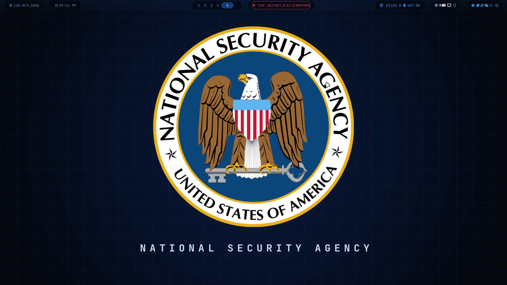
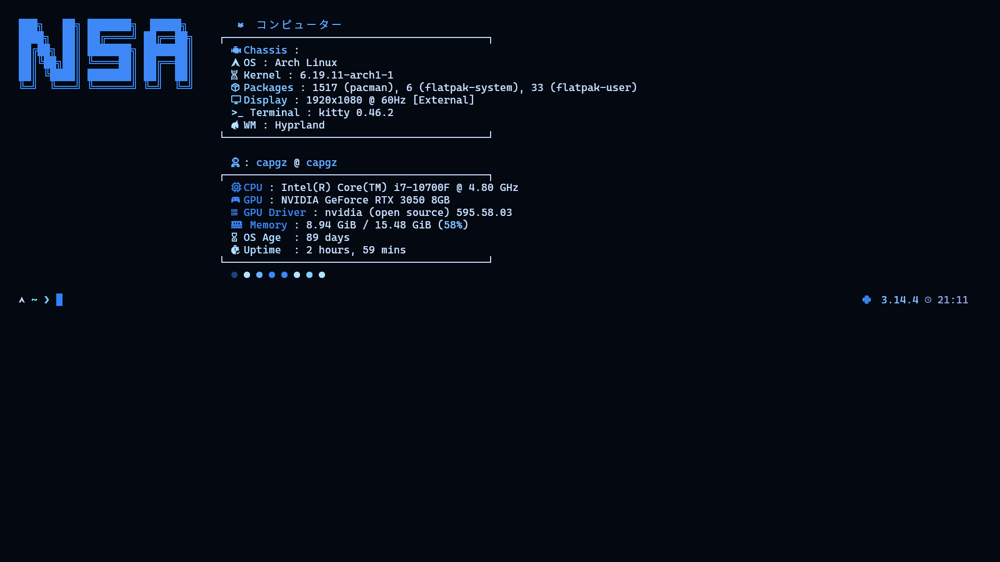
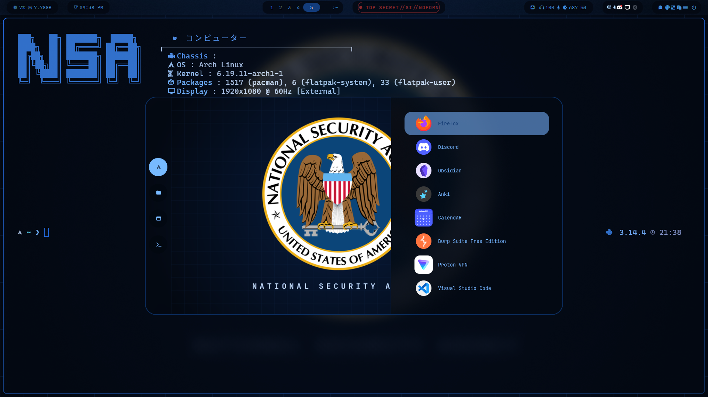
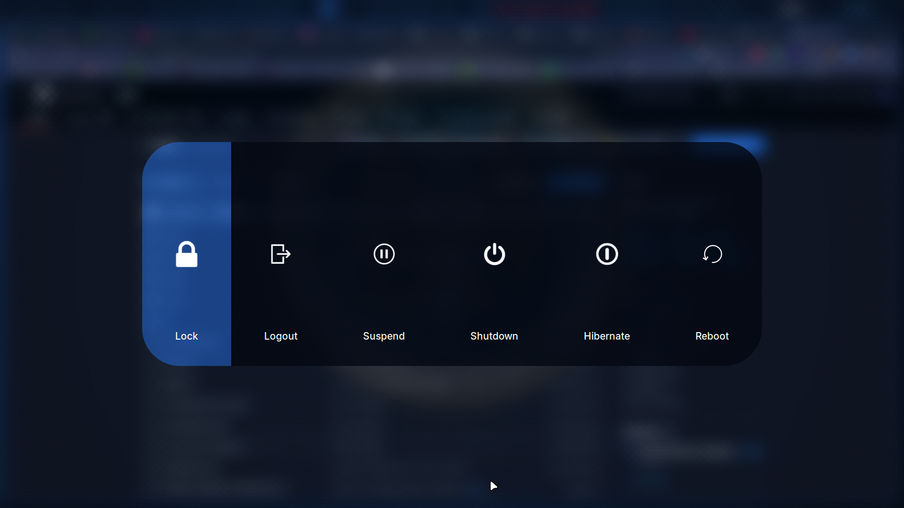
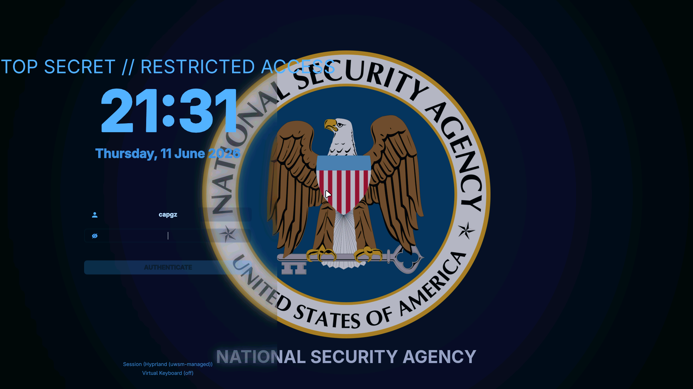
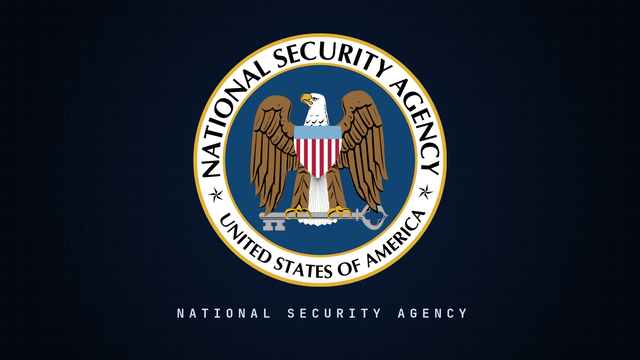
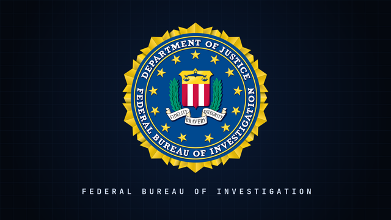
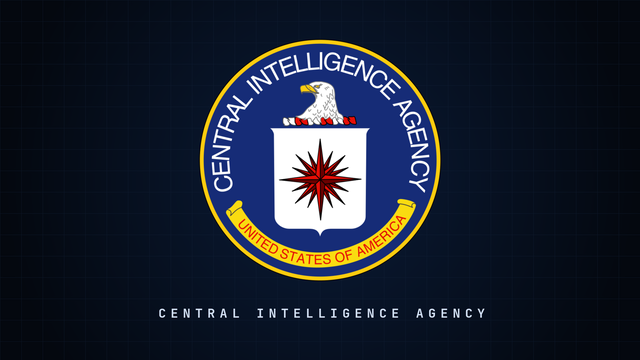
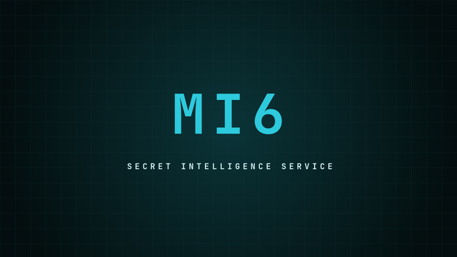

# Agency Themes — HyDE

A collection of 4 themes for [HyDE](https://github.com/HyDE-Project/HyDE) (Hyprland) with an
intelligence-agency aesthetic: dark, navy, surveillance. Font: JetBrains Mono Nerd Font.

| Theme | Aesthetic | Accent |
|-------|-----------|--------|
| **Agency** (NSA) | dark navy, NSA seal | `#3b82f6` |
| **FBI** | dark navy, FBI seal | `#3b82f6` |
| **CIA** | dark navy, CIA seal | `#3b82f6` |
| **MI6** | dark teal, typographic | `#2dc9dc` (cyan) |

## Screenshots

Desktop — waybar with the TOP SECRET chip, solid blue active workspace:



Terminal — kitty + fastfetch with the per-theme agency logo and `capgz@blacksite` prompt:



App launcher (rofi) — themed window with solid blue selection tile:



Logout overlay (wlogout) following the theme palette:



SDDM login screen (bonus theme, see [SDDM login theme](#sddm-login-theme-bonus)):



## Wallpaper previews

| Agency | FBI |
|--------|-----|
|  |  |

| CIA | MI6 |
|-----|-----|
|  |  |

## Installation

With HyDE installed, run (one per theme you want):

```bash
hyde-shell theme.patch.sh "Agency" "https://github.com/CapGuizera/hyde-agency-themes"
hyde-shell theme.patch.sh "FBI"    "https://github.com/CapGuizera/hyde-agency-themes"
hyde-shell theme.patch.sh "CIA"    "https://github.com/CapGuizera/hyde-agency-themes"
hyde-shell theme.patch.sh "MI6"    "https://github.com/CapGuizera/hyde-agency-themes"
```

Then pick the theme with `SUPER+SHIFT+T`.

Each theme ships: color palette (`theme.dcol`), wallpapers (seal + watermark variant),
Hyprland border colors, waybar, kitty, rofi, kvantum, and an optional hyprlock layout in
"TOP SECRET // RESTRICTED ACCESS" style (applied when wallbash is in *Theme colors* mode).

The `Source/` directory holds the archives the HyDE patcher extracts on install: a
self-contained `Agency` GTK theme (does not touch HyDE's Wallbash-Gtk) and the
`Tela-circle-blue` icon set. See [`Source/README.txt`](Source/README.txt) for details.

## SDDM login theme (bonus)

The `sddm/agency` directory ships a matching SDDM login theme (NSA seal background,
"TOP SECRET // RESTRICTED ACCESS" header, AGENT ID / ACCESS CODE fields, AUTHENTICATE
button). It is based on [sddm-astronaut-theme](https://github.com/Keyitdev/sddm-astronaut-theme)
and is visual-only: authentication, keyboard layout and session behavior are untouched.

```bash
# 1. Copy the theme (requires root)
sudo cp -r sddm/agency /usr/share/sddm/themes/agency

# 2. Point SDDM to it
sudo mkdir -p /etc/sddm.conf.d
printf '[Theme]\nCurrent=agency\n' | sudo tee /etc/sddm.conf.d/99-agency.conf
```

Tip: preview it without rebooting (opens a window in your session):

```bash
sddm-greeter-qt6 --test-mode --theme /usr/share/sddm/themes/agency
```

If your `/etc/sddm.conf` already has a `[Theme]` section, set `Current=agency` there instead
(it takes precedence over `sddm.conf.d`). To revert, remove `/etc/sddm.conf.d/99-agency.conf`.
The change applies on the next boot — do **not** restart the sddm service from inside a
running session.

## Notes

- The NSA, FBI and CIA seals are official US government insignia (public domain, sourced
  from Wikimedia Commons). They are used here decoratively, with no affiliation or
  endorsement implied.
- The SIS/MI6 crest is copyrighted; the MI6 theme uses a typographic composition instead.
- Themes are fully self-contained in the standard HyDE format: switching to other themes
  leaves no residue.

## License

MIT for the HyDE theme files. Seal images: public domain (US Gov). The SDDM theme keeps the
license of its base, [sddm-astronaut-theme](https://github.com/Keyitdev/sddm-astronaut-theme) (GPL-3.0).
